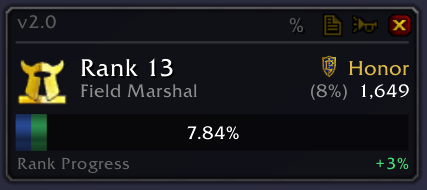
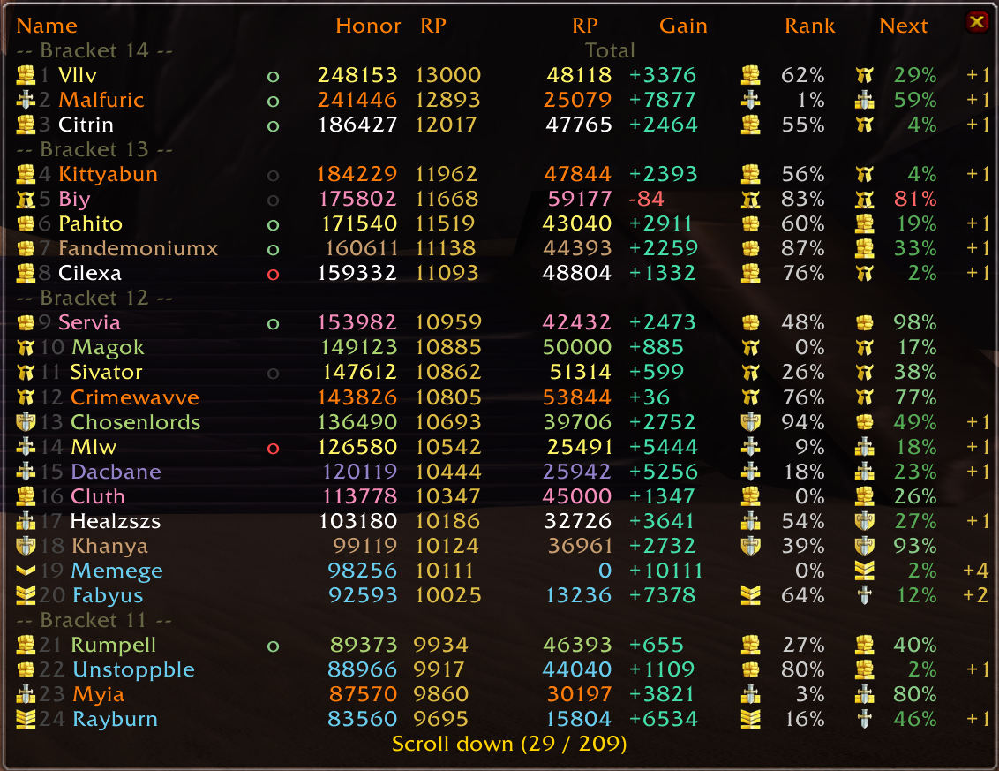
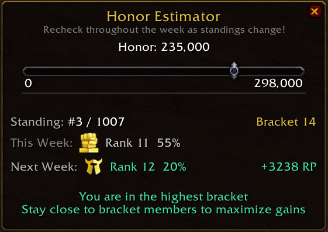

# TurtleHonorSpyEnhanced

Enhanced PvP standings tracker for **Turtle WoW**. This is a fork of HonorSpy with major modifications to improve accuracy and convenience.

The goal of this addon is to make the PvP honor system transparent and understandable for everyone. By showing how brackets, RP, and standings work, players can coordinate within their faction to rank as effectively as possible. Optimized bracket stacking benefits everyone — please support this effort!

> **Note:** This addon is only accurate on Turtle WoW. It will not sync with users of other HonorSpy versions.

Please reach out if you would like to see further enhancements. See you on the Battlegrounds!

 &ensp;**Citrin** (Tel'Abim - TurtleWoW)

### Overlay Widget

### Standings Table

### Honor Estimator

## What's Changed

- **Accurate RP calculations** — RP award/decay rewritten to match TurtleWoW server formulas, no de-ranking below your current rank's minimum RP, faction-only filtering by race
- **Enhanced standings table** — bracket separators with RP ranges, honor/RP/standing/rank/next week estimate columns, and fixed `/hs report`
- **Friend online tracking** — green/red/grey dots show online, in BG, or offline friends.
- **Compact overlay widget** — draggable panel with rank, progress bar, honor/standing, and next week estimate.
- **Honor Estimator** — slider to project rank/RP for any honor value. Warns about overshoot beyond the RP cap and reminds top bracket players to stay close for collective gains
- **Restructured minimap menu** — organized subgroups: overlay, estimator, report, display, settings, data

## Install

1. Download the latest release (or clone this repo)
2. Place the `TurtleHonorSpyEnhanced` folder in your `Interface/AddOns/` directory
3. If upgrading from HonorSpy or HonorSpyTurtle, your existing data will carry over automatically (same SavedVariables)
4. Disable or remove any previous HonorSpy addon to avoid conflicts

## How It Works

The addon runs in the background:

1. Inspects every player in range that you target or mouseover
2. Syncs your database with party/raid/BG members and guildmates
3. Estimates onward RP, Rank, and Progress using server-accurate formulas
4. Supports automatic weekly PvP reset (configurable reset day)
5. Hover over a player row to see how recently their data was updated
6. Supports sorting by RP and ThisWeekHonor
7. Row limit to reduce lag on table open (default: 750)
8. Export to CSV for use with external spreadsheets

Options can be accessed by right-clicking the minimap icon.

Only stores players with at least 1 HK.

## Commands

`/hs show` — show/hide standings table
`/hs estimate` — open the Honor Estimator panel
`/hs search player_name` — report a specific player's standing
`/hs standby` — enable/disable the addon

## Credits

Enhanced version created by **Citrin** (Turtle WoW — Tel'Abim)

Based on HonorSpy by **kakysha**, with Turtle WoW adaptations by **Mistaboom**, **Moxie**, and **syli**.
