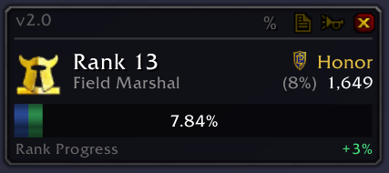
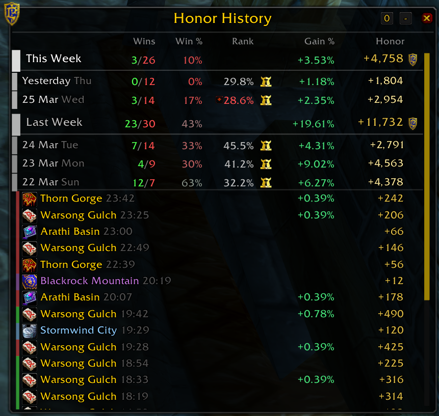

# TurtleHonorSpyEnhanced v2

A PvP tracking addon for **Turtle WoW** (Patch 1.18.1+).

> [!IMPORTANT]
> **Disable old HonorSpy addons.** HonorSpy, HonorSpyTurtle, and versions of this addon before v2.0 were built for the old bracket-based honor system, which no longer exists. They provide no useful information under the current system and will perform unecessary load. Disable them before using this version.

**  Citrin - Tel'Abim**
## Features

- **Rank overlay** — shows your current rank and weekly honor at a glance
- **Honor History** (`/hs history`) — scrollable log of every honor source, grouped by day and session, with win/loss records for battlegrounds
- **Detailed tooltips** — hover any session or day to see a full honor breakdown (kills, BGs, turn-ins, honor/hr)

Overlay

Honor History

## Install

**Via the Turtle WoW Launcher**
1. Go to **AddOns → Add new addon** and paste:
   `https://github.com/dnkrse/TurtleHonorSpyEnhanced.git`
2. The launcher keeps it updated automatically.

**Manual**
Place the `TurtleHonorSpyEnhanced` folder in `Interface/AddOns/`.

## Commands

| Command | Action |
|---|---|
| `/hs` | Toggle overlay |
| `/hs history` | Open Honor History window |
| `/hs version` | Show version |